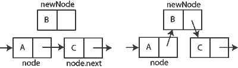
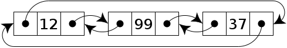

# Estruturas ligadas

Um estudo acerca das estruturas ligadas pilha, fila e lista. Para verificar o uso de estruturas que fazem uso de array, veja o outro estudo clicando [aqui.]().

Definição

A principal diferença entre uma estrutura com uso de array e uma estrutura ligada, é que esta ultima faz uso de ponteiros para tornar a inserção e remoção de dados abstratos mais coerente com a necessidade do sistema. Um array (vetor) precisa ter a quantidade de dados que irá comportar definida previamente, o que ocasiona dois problemas: ou se ocupa mais memória do que se precisa ao declarar array muito grande ou se, se o tamanho for pequeno, faltará espaço no vetor para armazenar alguns desses dados.

Para solucionar estes impasse usa-se estrutura ligada, onde o uso de ponteiros, manipulados corretamente, torna favorável o uso das estrutura pilha, fila ou lista, permitindo adicionar ou remover dados dinâmicamente.

## Funções X Ponteiros

Neste estudo usamos Javascript e, por se tratar de uma estrutura de alto nível, os ponteiros foram substituidos pela função No.

```js
function No(){
	var item;
	var proximoNo;
}
```

Ela apresenta as instâncias <b>item</b> e <b>proximoNo</b>. Item comporta o dado abstrato que se deseja manipular e proximoNo contém a referência para o nó seguinte, onde este comportará o item seguinte e assim por diante, até que o proximo nó aponte para <b>null</b>.

## Pilha X Fila X Lista

Das três estruturas de dados, pilha e fila se comportam conforme esperado, com a diferença de que se pode aumentar seu tamanho de forma dinâmica. O mesmo não ocorre quando se trata da listas encadeadas, pois devido sua maior flexibilidade de funcionamento em relação as demais, pode-se criar variações como <b>listas duplamente encadeadas</b>, <b>listas encadeadas circulares</b> e <b>listas circulares duplamente encadeadas</b>.

### Lista encadeada (Lista ligada)

Nenhuma novidade em relação a lista TAD, exceto a felxibilidade de tamanho ja mencionada.

 

* Inserção

 

* Remoção


### Lista duplamente encadeada (Lista duplamente ligada)


### Lista circular


### Lista circular duplamente encadeada (Lista circular ligada duplamente)


